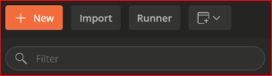
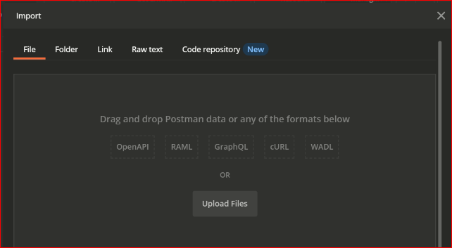
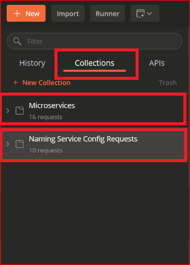
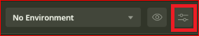
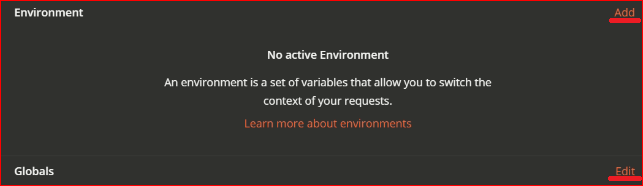
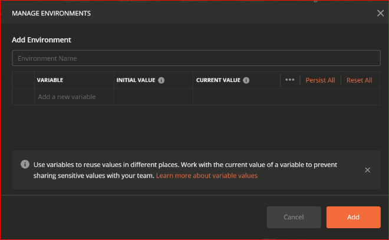
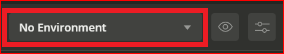

# Lab-01 Answers

> **1. Importing Postman Collection**

- Open Postman

- Click --> Import


- From the **Import** window select --> **File**

- Click on **Upload Files**



- Select the *postman_collection.json*  file that you wish to add to your **Postman**

- Once the collection is imported the collection can be accessed on the left pane under ***Collections*** 




> **2. Setup Environment Variables**

- To setup Environment Variables in Postman Click on the *eye-icon* on the top right corner of Postman



- Select **Add** aside of **Environment** label to add Environment specific Variables

- Select **Edit** aside of **Globals** label to add variables that can be accessed Globally (Not specific to a particular environment)



- Under the Manage Environment window add the required variable and its corresponding variable value

- Enter an Environment name. for example, ***Development***

- Click on the **Add** button to save the Environment Variables




> **3. Access Variables Stored in Environment Variables**

- To access the variables stored in Environment Variables, make sure that the required Environment is selected.



- If you want to access a variable stored in the Environment Variables say **costCenter** then this variable can be accessed in the postman request as ***{{costCenter}}***

**For Example**
```json
{
  "requested_for": "{{requested_for_email}}",
  "environment_id": "{{environmentId}}"
}
```

**Note :** Here variable *requested_for_email* and *environmentId* are stored as an environment variable in postman.
