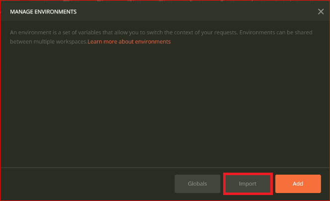

# Lab-01 Answers

> **1. Importing Postman Collection**

- Open Postman

- Click --> Import


- From the **Import** window select --> **File**

- Click on **Upload Files**


- Select the *postman_collection.json*  file that you wish to add to your **Postman**

- Once the collection is imported the collection can be accessed on the left pane under ***Collections*** 


> **2. Setup Environment Variables**

- To setup Environment Variables in Postman Click on the  on the top right corner of Postman


- Click on import button to store the Environment Variables into your postman



- Click on choose file to select *json-file* from your local computer.


**Note:** [Reference to JSON-FILE to import Environment Variables into your Postman](https://drive.google.com/file/d/1rwl2R7BVwS0sGvAI8kj5T9YTdL5TZe1f/view)


> **3. Access Variables Stored in Environment Variables**

- To access the variables stored in Environment Variables, make sure that the required Environment is selected.


- If you want to access a variable stored in the Environment Variables say **costCenter** then this variable can be accessed in the postman request as ***{{costCenter}}***

**For Example**
```json
{
  "requested_for": "{{requested_for_email}}",
  "environment_id": "{{environmentId}}"
}
```

**Note :** Here variable *requested_for_email* and *environmentId* are stored as an environment variable in postman.
