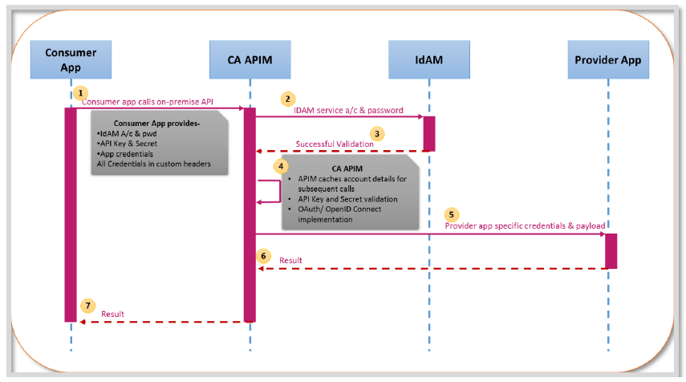

# Introduction

In this lesson, we will walk through how NGC-Microservice API get authenticated through Service Now

---

1. The Consumer application makes the service call by invoking the endpoint corresponding to the Provider application service in APIM (API Management). It provides the following credentials in headers:

    - **IdAM service account and password:** Account credentials are base64 encoded and passed in the *Proxy-Authorization* HTTP header.

    - **API Key and API Secret:** The API Key and Secret are used to authorize access to APIs in the Gateway. The API Key and Secret are passed in the ‘apikey’ and ‘apisecret’ headers respectively.
    - **Provider-specific credentials:** The API Provider must also provide credentials, which allows a Consumer to use the API.

2. APIM validates the service account against IdAM (Identity and Access Management).

3. APIM caches the service account in its internal cache. Subsequent calls are not validated with IdAM (i.e., step 2 is skipped). APIM looks for the account in its internal cache and validates it. After 15 minutes of inactivity, the entry is removed from the cache and the account is again authenticated against IdAM.

4. The API Key and Secret are used to determine if the Consumer application is authorized to call the Provider API. The API Key is also used as a means to track how many times a Consumer called an API. It will be used in the future as a means to place limits on often a Consumer can call an API.

## Reference:

[API Management (APIM)](https://pwc-spark.com/docs/DOC-1062463?dn=1)