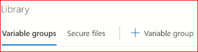
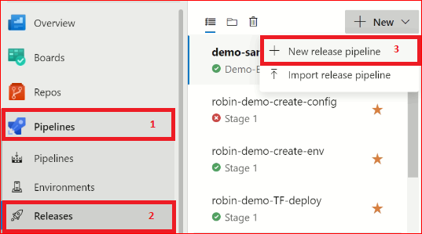
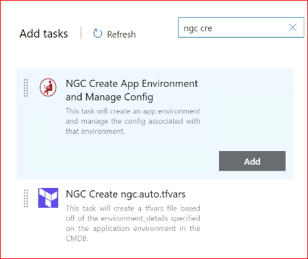
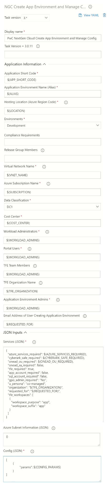

# Introduction 

In the lesson we will walk through different NGC Microservices available and how do we manage and automate the process of creating or maintaining of Application Environment, the configuration of Parameters, configure the resources name, etc using the Rest-API calls of NGC Microservices.

# About NGC-Microservice

The NGC-Microservice API allows developers and developer tools to make use of the various NextGen Cloud capabilities in ServiceNow via scripting. The API is REST-based and features validation to ensure all necessary attributes are provided and accurate.

---

> ## Automate the creation of an Application Environment using NGC Microservices

Automation of creating an Application Environment can be done in two ways:
> **Using Postman Request**

This API is used to submit a Create Application Environment request which triggers a series of automation based on the options specified.

**Endpoint:** https://api-central-sit.pwc.com/ngc-sandbox-service/v3/pwc_nextgen_request/provision_environment 
 
**Required Header:**
- Proxy-Authorization
- apikey
- apikeysecret
- Authorization
- Content-Type

**Request Body:**
```json
{
    "app_short_code": <APP_SHORT_CODE>,
    "u_alias": <ALIAS_NAME>,
    "u_hosting_location": <HOSTING_LOCATION>,
    "u_environments": "Development",
    "u_data_classification": "internal",
    "cost_center": <COST_CENTER>,
    "workload_admins": <WORKLOAD_ADMIN_EMAIL_ID>,
    "u_app_env_admins": <APP_ENV_ADMIN_EMAIL_ID>,
    "azure_services_required": true,
    "cyberark_safe_required": false,
    "onead_ou_required": false,
    "onead_sa_required": false,
    "tfe_required": true,
    "u_persona": "co-managed",
    "app_account_required": false,
    "sql_account_required": false,
    "gpo_admin_required": "No",
    "organization": <TFE_ORGANIZATION>,
    "tfe_team_members": <TFE_TEAM_MEMBERS>,
    "requested_for": <REQUESTED_FOR_MEMBER_MAIL_ID>,
    "vnet_name":<VNET_NAME>,
    "portal_users": <PORTAL_USER_MAIL_ID>,
    "subscription": <AZURE_SUBSCRIPTION_ID>,
    "tfe_workspaces": [
        {
            "workspace_purpose": "app",
            "workspace_suffix": "app"
        }
    ]
}
```
**Sample Response :**
```json
{
    "result": {
        "status": "success",
        "message": "Requested Item created: <SNOW_RITM_NO>",
        "record": <SNOW_RITM_NO>,
        "sysid": <SYS_ID>,
        "ciID": <CI_ID>,
        "ciCode": <APP_ENV_ID>, //APPLICATION  ENVIRONMENT ID
        "ciName": <APPLICATION ENVIRONMENT REFERENCE NAME >
    }
}
```

> **Using Azure Pipelines**

- Login to Azure DevOps
    - Select the required Project
    > Create a custom Variable Group
     - Click on Pipeline --> Library
     - Click on add variable group

     

     - populate the variable group with following names and respective values
        - API_KEY : API_KEY_VALUE
        - API_KEY_SECRET : API_KEY_SECRET_VALUE
        - API_PASSWORD : API_PASSWORD_VALUE
        - API_USER_NAME : API_USER_NAME_VALUE
        - AUTHORIZATION : AUTHORIZATION_VALUE
        - PROXY_AUTH : PROXY_AUTH_VALUE
        - SNOW_API_BASE_URL : SNOW_API_BASE_URL_VALUE
    - Save thr variable group with a name
    > Create release pipeline for Config Params
    - Click on Pipeline --> Releases

    
    - Select **Empty Job** template
    - Add task to the initial stage
    - Under agent job --> Search for NGC *create app environment*

    
    - Update the following fields of agent
        - Application Short Code : $(APP_SHORT_CODE)
        - Application Short Code : $(APP_SHORT_CODE)
        - Application Environment Name (Alias) : $(ALIAS)
        - Hosting Location (Azure Region Code) : $(LOCATION)
        - Virtual Network Name : $(VNET_NAME)
        - Azure Subscription Name : $(SUBSCRIPTION)
        - Cost Center : $(COST_CENTER)
        - Workload Administrators : $(WORKLOAD_ADMINS)
        - Portal Users : $(WORKLOAD_ADMINS)
        - TFE Team Members - $(WORKLOAD_ADMINS)
        - TFE Organization Name : $(TFE_ORGANIZATION)
        - Application Environment Admins : $(WORKLOAD_ADMINS)
        - Email Address of User Creating Application Environment : $(REQUESTED_FOR)
        - Services (JSON) :

        ```json
        {
        "azure_services_required": $(AZURE_SERVICES_REQUIRED),
        "cyberark_safe_required": $(CYBERARK_SAFE_REQUIRED),
        "onead_ou_required": $(ONEAD_OU_REQUIRED),
        "onead_sa_required": false,
        "tfe_required": true,
        "app_account_required": false,
        "sql_account_required": false,
        "gpo_admin_required": "No",
        "u_persona": "co-managed",
        "organization": "$(TFE_ORGANIZATION)",
        "requested_for": "$(REQUESTED_FOR)",
        "tfe_workspaces": [
            {
            "workspace_purpose": "app",
            "workspace_suffix": "app"
            }
        ]
        }
        ```
        - Azure Subnet Information (JSON) : {}
        - Config (JSON) : 
        ```json
        [
            {
		        "params": $(CONFIG_PARAMS)
	        }
        ]
        ```
    

    - Assign values declared in agent in Azure Variables:
        - ALIAS : ALIAS_VALUE
        - APP_SHORT_CODE: APP_SHORT_CODE_VALUE
        - AZURE_SERVICES_REQUIRED : **true**
        - CONFIG_PARAMS : **{}**
        - COST_CENTER : COST_CENTER_VALUE
        - CYBERARK_SAFE_REQUIRED : **true**
        - LOCATION : LOCATION_VALUE
        - ONEAD_OU_REQUIRED : **true** 
        - ONEAD_SA_REQUIRED : **false**
        - PASSWORD: **$(API_PASSWORD)**
        - REQUESTED_FOR : REQUESTED_FOR_VALUE
        - SUBSCRIPTION : AZURE_SUBSCRIPTION_VALUE
        - TFE_ORGANIZATION : TFE_ORGANIZATION_VALUE
        - USERNAME : **$(API_USER_NAME)**
        - VNET_NAME : VNET_NAME_VALUE
        - WORKLOAD_ADMINS : WORKLOAD_ADMINS_VALUE
        

**Note :** *WORKLOAD_ADMINS_VALUE* can be a "," comma-separated values if workload admin is more than one.


- Add the variable group created earlier in **Variable groups**  

- Click on **Create Release** to run the pipeline

> ## Integration required to deploy a software

To deploy an application using the capabilities of NGC Microservices using Azure DevOps, the artifact of the application has to be created (*refer the following link to create an artifact of a application [How to create artifact](../NGC-301/Lab-02-Answers.md)*) and later on the artifact of the application can be integrated with the deploy pipeline to execute the process.(refer the following link to know [How to make an end to end deployment](../NGC-401/Lab-01-Answers.md))