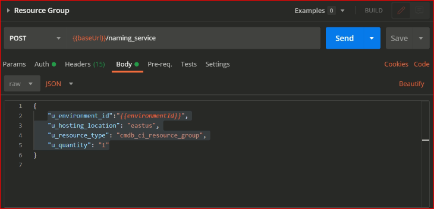
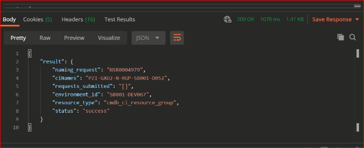
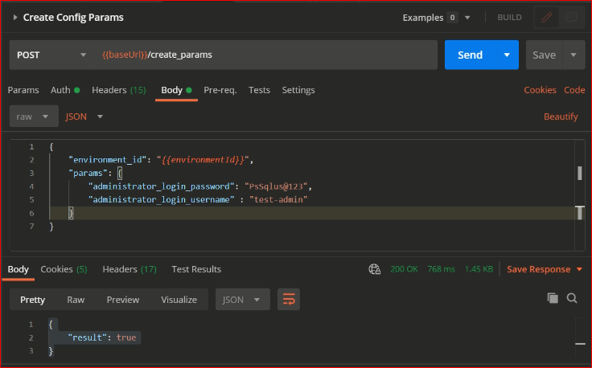

# Introduction
In this lesson we will walk through how variables are been stored in CMDB (Configuration Management Database).

## **What is a CMDB**
A configuration management database (CMDB) is a database that contains all relevant information about the hardware, IP Components and software components etc. and it also contains the relationships between those components. Within the CMDB, the support information for each service offering is stored in a Configuration Item (CI) specific to that service. This information includes the service name and description, assignment groups, change management approvers and service roles as well as other information directly related to the service support. So, in this way cmdb in servicenow provides an organized view of configuration data so that the organization gains the full visibility of its infrastructure and services, leading to more control of organization environment and better decisions.

## **How do we use CMDB**
NGC(NextGen Cloud) provides multiple Microservices and ADO(Azure DevOps) extensions through which values to variables can be stored or retrived from CMDB for a particular App-Environment. 

## **Where we get the values from for the Variables stored in CMDB**

Naming Service are the Rest API services which provides unique names and also ensures the proper validation are applied to the values for the requested resources.

To avail the feature of NGC Naming Service get the postman collection from the [this link..](https://github.pwc.com/pwc-ngc-platform/sandbox-service-tools/blob/master/Tools/Postman/Naming_Service_Config_Requests.postman_collection.json) 

- Import the collection to the postman and configure the following variables
    - Proxy-Authorization
    - apikey
    - apikeysecret 
    - username 
    - password 
    - environmentId 

- Here is the sample request to get the name for a ***Resource-Group*** through Naming-Service
    - URL- baseUrl/naming_service
        > **Note** : For Sandbox baseUrl- https://api-central-sit.pwc.com/ngc-sandbox-service/v3/pwc_nextgen_request/naming_service

        **Hearder Parameters**
        - Proxy-Authorization
        - apikey
        - apikeysecret 
        - username 
        - password 
        - environmentId 

        **Body Parameters**
        ```
        {
            "u_environment_id":"{{environmentId}}", 
            "u_hosting_location": "eastus", 
            "u_resource_type":  "cmdb_ci_resource_group",
             "u_quantity": "1"
        }
        ```
        > -  Parameter **"u_resource_type"** refers to the type of resource for which the values is requested like : *Resource Group, Load Balancer etc*.
    
      **Note :** The reference values for the requested parameters is available in the [NGC Platform - Naming Service API Doc](https://docs.google.com/document/d/1n-Jtfo1ih8I5chOOwxT-u7-tvXUAVIMCocoiirz2y_c/edit#heading=h.cd34ot7rtyfy)

        > - Parameter **"u_quantity"** refers to the quantity of names required for a particular resource

        ***Sample Output***
        ```
        {
          "result": {
                        "naming_request": "NSR0004979",
                        "ciNames": "PZI-GXU2-N-RGP-SB001-D052",
                        "requests_submitted": "[]",
                        "environment_id": "SB00X-DEV0XX",
                        "resource_type": "cmdb_ci_resource_group",
                        "status": "success"
                    }
        }
        ```
        
**Sample request**



**Sample Response**




## **How to store/update values**
There are two ways to store or update values of variables in CMDB:

**1) Using the postman request:**

NGC(NextGen Cloud) provides multiple Microservices to play around with Environment and variables, **Create Config Params** Microserice provides the flexibility to add the variables to a particular App-Environment.
> **Note** : Postman collections to access the NGC(NextGen Cloud) Microservices is avaialble [here](https://github.pwc.com/pwc-ngc-platform/sandbox-service-tools/blob/master/Tools/Postman/Microservices.postman_collection.json)


   - Sample postman request to add variables to CMDB
        - URL- baseUrl/create_params
        > **Note** : For Sandbox baseUrl- https://api-central-sit.pwc.com/ngc-sandbox-service/v3/pwc_nextgen_request/create_params

        **Hearder Parameters**
        - Proxy-Authorization
        - apikey
        - apikeysecret 
        - username 
        - password 
        - environmentId 

        **Body Parameters**
        ```
        {
            "environment_id": "{{environmentId}}",
            "params": {
                "administrator_login_password": "PsSqlus@123",
                "administrator_login_username" : "test-admin"
                }
        }
        ```

        ***Sample Output***
        ```
        {
            "result" : true
        }
        ```


    
**2) Creating a pipeline** 

  Creating pipeline to configure the variables in CMDB is explained in Lesson plan: **NGC-501**


## **Default values that can be configured with variables.tf in terraform.**

The default variables that can be configured within the variables.tf file in terraform are:
```
variable "__ghs" {
  type = any
}

variable "system_parameters" {
  type = any
}

variable "user_parameters" {
  type = any
}

```

> **variable "__ghs"** : These are additional system parameters that can be used much like system_parameters. Examples include hosting location, resource group name, etc.

>**variable "system_parameters"** : These variables represent data that is automatically pulled from ServiceNow that can be referenced in your deployment. Examples include Tags, Environment Owner, etc.

>**variable "user_parameters"** : These are custom defined variables that the user places into the ServiceNow CMDB using the Add Config Parameters endpoint or extension. Examples include VM Names, SQL Database Names, etc.